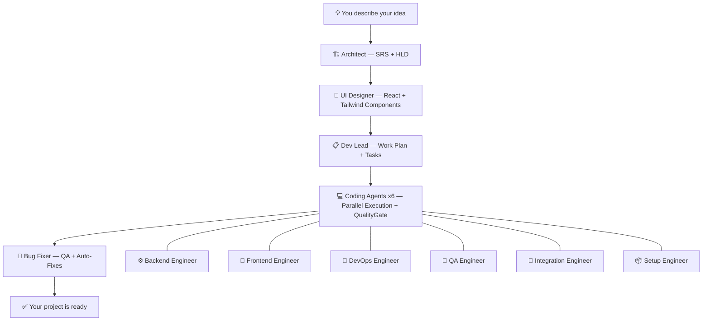

<div align="center">

# 🤖 OneManCrew Dev AI

### Your AI-Powered Software Development Team

**One developer. Five AI agents. Full project delivery.**

[](https://www.electronjs.org/)
[](https://reactjs.org/)
[](https://tailwindcss.com/)
[](LICENSE)

---

*OneManCrew Dev AI is a desktop application that orchestrates multiple AI agents to take a software project from idea to implementation — architecture, UI design, task planning, code generation, and bug fixing — all from a single interface.*

</div>

---

## ✨ What It Does

OneManCrew Dev AI replaces an entire development team with a pipeline of specialized AI agents. You describe what you want to build, and the agents collaborate to deliver it:

| Stage | Agent | What It Does |
|-------|-------|-------------|
| 1 | **🏗️ Architect** | Dominant & decisive — auto-decides tech stack, generates SRS & HLD (with Infrastructure Requirements) |
| 2 | **🎨 UI Designer** | Creates React + Tailwind components with a full Design System (Lucide icons, Framer Motion animations, design tokens) |
| 3 | **📋 Dev Lead** | Breaks the project into phases, tasks, and assigns specialist agents |
| 4 | **💻 Coding Agents** | 6 specialist agents (Backend, Frontend, DevOps, QA, Integration, Setup) execute tasks in parallel |
| 5 | **🐛 Bug Fixer** | Scans project tree, performs Root Cause Analysis, identifies bugs, and dispatches fixes to the right specialist |

Each agent has its own chat interface where you can interact, guide, and override decisions. The entire pipeline produces real files on disk — ready to run.

---

## 🎬 How It Works



### 💻 The 6 Specialist Coding Agents

The Dev Lead assigns each task to the most appropriate specialist. These agents work **in parallel** — multiple tasks execute simultaneously for maximum speed.

| Agent | Specialty | Expertise |
|-------|-----------|-----------|
| ⚙️ **Backend Engineer** | Server-side & API | Node.js, Python, Java, Go, C#, REST, GraphQL, databases, ORMs, middleware, microservices |
| 🎨 **Frontend Engineer** | UI Implementation | React, Angular, Vue, Svelte, HTML/CSS, Tailwind, responsive design, animations, components |
| 🔧 **DevOps Engineer** | Infrastructure & CI/CD | Docker, Kubernetes, CI/CD pipelines, Nginx, cloud (AWS/Azure/GCP), scripting, monitoring |
| 🧪 **QA Engineer** | Testing & Quality | Unit tests, E2E tests, Jest, Playwright, Cypress, pytest, coverage, TDD/BDD |
| 🔗 **Integration Engineer** | System Wiring | API clients, state management (Redux/Zustand), data flow, WebSockets, service layers |
| 📦 **Setup Engineer** | Packaging & Config | Build tools (Vite/Webpack), installers, project scaffolding, dependency management, electron-builder |

Each agent receives a tailored system prompt with 25-35 years of domain expertise, ensuring high-quality, production-ready code output.

---

## 🚀 Getting Started

### Prerequisites

- **Node.js** 18+ — [Download](https://nodejs.org/)
- **Git** — [Download](https://git-scm.com/)
- **An LLM API key** — supports OpenAI, Anthropic, Google Gemini, OpenRouter, or any OpenAI-compatible endpoint

### Installation

```bash
# Clone the repository
git clone https://github.com/OneManCrew/OneManCrewDevAI.git
cd OneManCrewDevAI

# Install dependencies
npm install

# Start in development mode
npm run dev
```

The app will open automatically. On first launch:

1. Click the **⚙️ Settings** gear icon in the sidebar
2. Select your **LLM Provider** (OpenAI, Anthropic, Gemini, OpenRouter, or Custom)
3. Enter your **API Key**
4. Choose your preferred **model**
5. Click **Save**

### Production Build

```bash
# Build the renderer
npm run build

# Run the production app
npm start
```

---

## 🔧 Configuration

### LLM Providers

| Provider | Models | Notes |
|----------|--------|-------|
| **OpenAI** | GPT-4o, GPT-4, GPT-3.5 | Recommended for best results |
| **Anthropic** | Claude 3.5 Sonnet, Claude 3 Opus | Excellent for code generation |
| **Google Gemini** | Gemini Pro, Gemini Flash | Good balance of speed and quality |
| **OpenRouter** | 100+ models | Access to all major providers via one API |
| **Custom** | Any OpenAI-compatible API | Self-hosted models (Ollama, LM Studio, etc.) |

### Per-Agent Model Overrides

Each agent can use a different model. For example:
- **Architect** → Claude 3 Opus (deep reasoning)
- **Coding Agents** → GPT-4o (fast code generation)
- **Bug Fixer** → Claude 3.5 Sonnet (careful analysis)

Configure this in **Settings → Per-Agent Model Overrides**.

---

## 📁 Project Structure

```
OneManCrewDevAI/
├── main.js                          # Electron main process
├── preload.js                       # Secure IPC bridge
├── package.json
├── vite.config.js                   # Vite bundler config
├── tailwind.config.js               # Tailwind CSS config
├── scripts/
│   └── launch-electron.js           # Electron launcher script
└── src/renderer/
    ├── App.jsx                      # Main app component & routing
    ├── main.jsx                     # React entry point
    ├── components/
    │   ├── ChatInterface.jsx        # 🏗️ Architect agent chat
    │   ├── UIDesignerChat.jsx       # 🎨 UI Designer agent chat
    │   ├── DevLeadChat.jsx          # 📋 Dev Lead agent chat
    │   ├── CodingPhase.jsx          # 💻 Coding orchestration & task board
    │   ├── BugFixerChat.jsx         # 🐛 Bug Fixer agent chat + console
    │   ├── TaskBoard.jsx            # Visual task board (phases/list/board)
    │   ├── SettingsPanel.jsx        # LLM provider & model configuration
    │   ├── ProjectSelection.jsx     # Workspace/project selector
    │   ├── Sidebar.jsx              # Navigation sidebar
    │   ├── DocumentPanel.jsx        # SRS/HLD document viewer
    │   ├── ModelSelector.jsx        # Per-chat model selector
    │   ├── TokenUsageBadge.jsx      # Token usage badge in TitleBar
    │   └── ...                      # Supporting UI components
    ├── services/
    │   ├── architectAgent.js        # Architect agent logic & prompts
    │   ├── devLeadAgent.js          # Dev Lead agent & incremental plan builder
    │   ├── uiDesignerAgent.js       # UI Designer agent logic
    │   ├── codingAgents.js          # 6 specialist coding agents + orchestrator
    │   ├── bugFixerAgent.js         # Bug analysis & fix execution
    │   ├── llmProviders.js          # Multi-provider LLM abstraction
    │   ├── electronBridge.js        # Electron API bridge (with browser fallback)
    │   ├── tokenUsageTracker.js     # Token usage tracking + cost estimation
    │   ├── notificationService.js   # Desktop notifications
    │   └── agentTools.js            # Shared agent tool definitions
    └── styles/
        └── index.css                # Tailwind + custom styles
```

### Generated Project Output

When you run the pipeline on a project, it generates:

```
your-project/
├── docs/
│   ├── SRS.md                       # Software Requirements Specification
│   ├── HLD.md                       # High-Level Design document
│   ├── context_summary.json         # Shared Knowledge Base (auto-updated)
│   ├── project_knowledge.json       # Token usage data (persisted across sessions)
│   └── dev-lead/
│       ├── workplan.json            # Full task breakdown
│       ├── coding-status.json       # Task execution status
│       ├── chat-history.json        # Dev Lead conversation
│       └── task-logs/               # Per-task execution logs
└── src/
    ├── theme/
    │   └── colors.json              # Design tokens (from UI Designer)
    ├── components/
    │   └── generated_ui/            # React + Tailwind components
    │       ├── AppShell.jsx
    │       ├── Sidebar.jsx
    │       └── ...                   # All UI components
    └── ...                           # Generated source code
```

---

## 🛠️ Tech Stack

| Layer | Technology |
|-------|-----------|
| **Desktop Shell** | Electron 30 |
| **Frontend** | React 18 + Vite 5 |
| **Styling** | Tailwind CSS 3.4 |
| **Markdown** | react-markdown + remark-gfm |
| **IPC** | Electron contextBridge (secure) |
| **LLM Integration** | Native fetch with streaming support |

---

## 🤝 Contributing

Contributions are welcome! Here's how to get started:

1. **Fork** the repository
2. **Create** a feature branch: `git checkout -b feature/amazing-feature`
3. **Commit** your changes: `git commit -m 'Add amazing feature'`
4. **Push** to the branch: `git push origin feature/amazing-feature`
5. **Open** a Pull Request

### Development Tips

- Run `npm run dev` for hot-reload development
- The app uses Vite HMR for instant UI updates
- Electron main process changes require a restart
- All agent prompts are in `src/renderer/services/*Agent.js`

---

## �️ Infrastructure Features

| Feature | Description |
|---------|-------------|
| **Safe File Writes** | `FileLockManager` prevents concurrent agent writes to the same file via lock-and-retry mechanism |
| **Command Queue + Timeout** | Sequential command execution with 300s timeout and process tree kill on stuck commands |
| **Syntax Validation** | Auto-runs `node -c` on every `.js`/`.jsx` file after write; injects errors back to LLM for auto-fix (max 2 retries) |
| **QualityGate** | Shadow LLM reviewer verifies code against task requirements + SRS before marking done (max 2 rounds) |
| **Shared Knowledge Base** | `docs/context_summary.json` — tracks all files, exports, technologies, entities (API routes, components, env vars), and LLM-generated task summaries; injected into every agent's prompt |
| **Design System** | `src/theme/colors.json` design tokens created during UI Discovery; all components use Lucide React icons + Framer Motion animations |
| **Stop-on-Failure** | Pauses execution when a critical task fails; asks user to continue or stop; marks downstream tasks as BLOCKED |
| **Smart Preview** | Detects running Vite dev server (ports 5173/5174/3000/3001) via native IPC probe for live preview, or generates a styled HTML code viewer as fallback |
| **Token Usage Tracker** | Centralized tracking of input/output tokens + estimated cost across all LLM providers; per-agent breakdown; persisted to `project_knowledge.json`; compact TitleBar badge |
| **.env Manager** | Coding agents can set environment variables via `set-env-variable` tool; supports `ASK_USER` flow for secrets; auto-masks sensitive keys in logs |
| **Recursive Directory Scanner** | `fs:readDirRecursive` IPC handler for Bug Fixer to scan project tree before diagnosis (ignores `node_modules`, `.git`, `dist`) |
| **Root Cause Analysis** | Bug Fixer must perform structured RCA (Symptom → Trace → Root Cause → Fix Approach) before creating any bug report |
| **Setup Engineer Rules** | Mandatory `electron-builder` install for Desktop/Standalone apps; complete `package.json` scripts; `README.md` generation |
| **Project Skeleton Integration** | Dev Lead adds mandatory integration verification task at end of every phase (HTML/script validation, Electron main.js, smoke test) |

## 📋 Roadmap

- [x] ~~Agent memory across sessions~~ → Shared Knowledge Base (`context_summary.json`)
- [x] ~~Automated testing pipeline~~ → Syntax validation + QualityGate
- [x] ~~Token usage tracking~~ → Centralized tracker with per-agent breakdown + cost estimation
- [x] ~~Environment variable management~~ → `.env` manager with `ASK_USER` flow for secrets
- [x] ~~Dominant Architect~~ → Auto-decides tech stack, Infrastructure Requirements in HLD
- [x] ~~Bug Fixer directory scanning~~ → Recursive project tree scan + Root Cause Analysis
- [ ] Multi-language support
- [ ] Git integration (auto-commit generated code)
- [ ] Plugin system for custom agents
- [ ] Project templates
- [ ] VS Code extension

---

## 📄 License

This project is licensed under the **MIT License** — see the [LICENSE](LICENSE) file for details.

---

<div align="center">

**Built with ❤️ by [OneManCrew](https://github.com/OneManCrew)**

*Because one developer with AI is all you need.*

</div>
